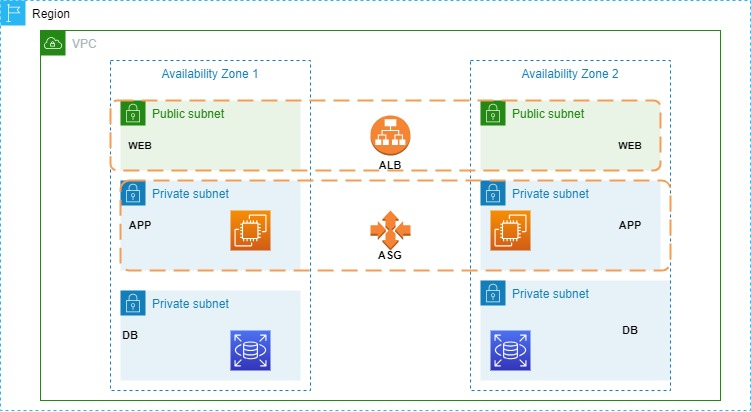

# Three-Tier Web Application Architecture on AWS

## Table of Contents

1. [Introduction](#introduction)
2. [Prerequisites](#prerequisites)
3. [Procedure Overview](#procedure-overview)
4. [Step-by-Step Procedure](#step-by-step-procedure)
   1. [Create Virtual Private Cloud (VPC)](#step-1-create-virtual-private-cloud-vpc)
   2. [Create Subnets](#step-2-create-subnets)
   3. [Configure Internet Gateway](#step-3-configure-internet-gateway)
   4. [Configure Route Tables](#step-4-configure-route-tables)
   5. [Create Security Groups](#step-5-create-security-groups)
   6. [Launch Database](#step-6-launch-database)
   7. [Launch Application Servers](#step-7-launch-application-servers)
   8. [Set up Load Balancer](#step-8-set-up-load-balancer)
   9. [Configure Auto Scaling](#step-9-configure-auto-scaling)
   10. [Create Bastion Host](#step-10-create-bastion-host)
5. [Conclusion](#conclusion)
6. [License](#license)

## Introduction

This repository provides a detailed procedure for setting up a Three-Tier Web Application Architecture on AWS. The architecture will consist of a Virtual Private Cloud (VPC) with two public subnets and two private subnets spread across two different Availability Zones (AZs). The web application will use Amazon RDS for the database, and a load balancer and auto-scaling will be implemented to handle varying levels of traffic. Additionally, a bastion host will be set up in the public subnet to provide secure remote access to instances in the private subnets.

## Procedure Overview

1. Create a VPC with two public subnets and two private subnets across different AZs.
2. Configure Internet Gateway for public internet access.
3. Set up route tables to control traffic flow between subnets and the internet.
4. Create security groups to control inbound and outbound traffic for different components.
5. Launch an RDS database instance in one of the private subnets.
6. Launch EC2 instances for the application servers in the other private subnet.
7. Set up an Application Load Balancer (ALB) to distribute incoming traffic across the application server instances in the public subnets.
8. Configure Auto Scaling to automatically adjust the number of instances based on traffic demand.
9. Launch a bastion host in one of the public subnets for secure remote access.

## Step-by-Step Procedure

### Step 1: Create Virtual Private Cloud (VPC)

1. Open the AWS Management Console and navigate to the VPC service.
2. Click on "Create VPC" and provide a name for your VPC (e.g., MyVPC).
3. Choose an IPv4 CIDR block (e.g., 10.0.0.0/16) that does not overlap with your existing networks.
4. Click "Create VPC."

### Step 2: Create Subnets

1. In the VPC dashboard, select your newly created VPC (e.g., MyVPC).
2. Click on "Create Subnet."
3. For the first public subnet:
   - Provide a name (e.g., PublicSubnet1) and choose an availability zone.
   - Specify an IPv4 CIDR block for the subnet (e.g., 10.0.1.0/24).
   - Click "Create."

4. Repeat the process to create the second public subnet in a different availability zone (AZ) with a distinct IPv4 CIDR block (e.g., 10.0.2.0/24).

5. Now, create two private subnets, one in each AZ:
   - Provide names (e.g., PrivateSubnet1, PrivateSubnet2) for the private subnets.
   - Choose the respective AZs and specify distinct IPv4 CIDR blocks (e.g., 10.0.3.0/24, 10.0.4.0/24) for each subnet.
   - Click "Create" for each subnet.

### Step 3: Configure Internet Gateway

1. In the VPC dashboard, navigate to "Internet Gateways."
2. Click on "Create Internet Gateway" and provide a name (e.g., MyIGW).
3. Select the newly created internet gateway (e.g., MyIGW), click on "Actions," and choose "Attach to VPC."
4. Attach the internet gateway to your VPC (e.g., MyVPC).

### Step 4: Configure Route Tables

1. In the VPC dashboard, go to "Route Tables."
2. Identify the main route table associated with your VPC (e.g., rtb-xxxxxxxx).
3. Edit the main route table and add a new route:
   - Destination: 0.0.0.0/0 (to allow access to the internet).
   - Target: Select the internet gateway (e.g., MyIGW) created earlier.
   - Click "Save routes."

4. Now, associate the public subnets (e.g., PublicSubnet1, PublicSubnet2) with the main route table to enable internet connectivity for instances launched in these subnets.

### Step 5: Create Security Groups

1. Go to the EC2 dashboard and select "Security Groups."
2. Click on "Create Security Group" and provide a name (e.g., AppServerSG) and description (e.g., Security group for application servers).
3. Configure inbound rules for the Application Servers Security Group:
   - Add a rule to allow inbound traffic on the HTTP port (e.g., port 80) from anywhere (0.0.0.0/0).
   - Add a rule to allow inbound traffic on the HTTPS port (e.g., port 443) from anywhere (0.0.0.0/0).
   - Click "Create Security Group."

4. Similarly, create a Security Group for the Database (e.g., DBSG) with an inbound rule to allow traffic on the database port (e.g., port 3306 for MySQL) from the Application Servers Security Group (e.g., AppServerSG).

5. Additionally, create a Security Group for the Bastion Host (e.g., BastionHostSG) with inbound rules to allow SSH (port 22) traffic from your trusted IP address only.

### Step 6: Launch Database

1. In the RDS dashboard, click on "Create Database."
2. Choose the appropriate database engine (e.g., MySQL, PostgreSQL) and select "Standard Create."
3. Configure the following settings for your RDS instance:
   - DB instance identifier: Provide a name for your RDS instance (e.g., MyDBInstance).
   - Master username and password: Set the credentials for your database.
   - DB instance class: Choose the appropriate instance type based on your workload.
   - Storage: Allocate storage for your database instance.
   - Multi-AZ deployment: Choose "No" if you don't need multi-AZ redundancy for the database at this point.
   - VPC: Select your VPC (e.g., MyVPC).
   - Subnet group: Choose the DB subnet group that includes your private subnets.
   - Security group: Select the DBSG security group created earlier.

4. Click "Create Database" to launch the RDS instance.

### Step 7: Launch Application Servers

1. In the EC2 dashboard, click on "Launch Instance."
2. Choose an Amazon Machine Image (AMI) suitable for your application and click "Next."
3. Select the instance type, configure instance details, and choose one of the private subnets for launch.
4. Add storage, tags, and security group (use the Application Servers Security Group created earlier).
5. Review the configuration and click "Launch."
6. Choose an existing key pair or create a new one to access the instances securely.

### Step 8: Set up Load Balancer

1. In the EC2 dashboard, go to "Load Balancers" and click on "Create Load Balancer."
2. Choose "Application Load Balancer" and click "Create."
3. Configure the load balancer:
   - Provide a name and select the VPC and both public subnets.
   - Configure the listeners (e.g., HTTP on port 80).
   - Set up the target group with the instances launched by the Auto Scaling Group (ASG) in the private subnets.
   
4. Review the settings and click "Create."

### Step 9: Configure Auto Scaling

1. In the EC2 dashboard, go to "Auto Scaling Groups" and click on "Create Auto Scaling Group."
2. Select the launch template created when launching the application servers.
3. Configure the scaling policies:
   - Choose the desired capacity, minimum, and maximum number of instances.
   - Set up scaling policies based on a metric such as average CPU utilization.
   - Define the scaling actions (scale out and scale in) and their thresholds.
4. Review the settings and create the Auto Scaling Group.

### Step 10: Create Bastion Host

1. In the EC2 dashboard, click on "Launch Instance."
2. Choose an appropriate AMI for the bastion host (e.g., Amazon Linux).
3. Select an instance type, configure instance details, and choose one of the public subnets for launch.
4. Add storage, tags, and security group (use the Bastion Host Security Group created earlier).
5. Review the configuration and click "Launch."
6. Choose an existing key pair or create a new one to access the bastion host securely.

## Conclusion

Congratulations! We have successfully set up a scalable and secure Three-Tier Web Application Architecture on AWS. The architecture provides a robust foundation for hosting your web application, ensuring high availability, fault tolerance, and efficient handling of traffic. Regularly monitor your resources and apply security best practices to maintain the security and performance of the application.

.
